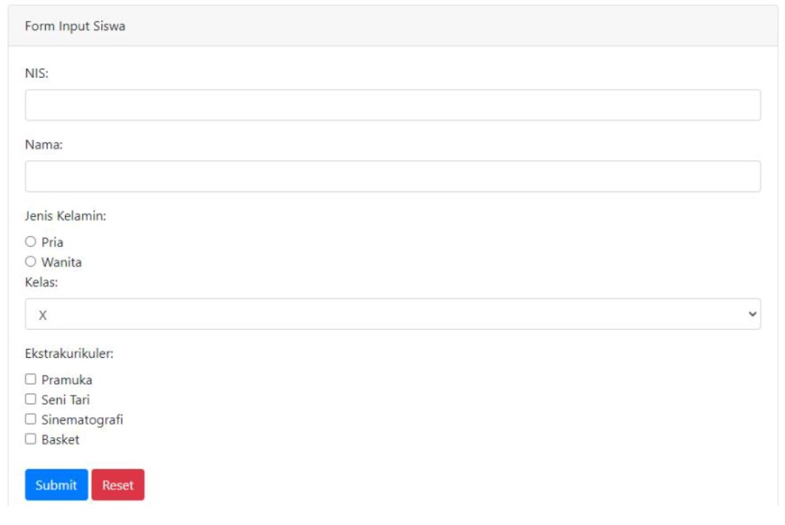

# Praktikum PBP D2 ke-3

Buatlah form seperti gambar berikut:

Aturan validasi:

1. Semua field harus diisi.
2. NIS terdiri atas 10 karakter dan hanya boleh berisi angka 0..9.
3. Jika siswa kelas X atau XI, maka program menampilkan pilihan ekstrakurikuler. Siswa wajib memilih kegiatan ekstrakurikuler yang diminati, minimal 1 maksimal 3. Jika kelas XII siswa tidak boleh mengikuti kegiatan ekstrakurikuler, sehingga program tidak perlu menampilkan kegiatan ekstrakurikuler.

Selamat mengerjakan!